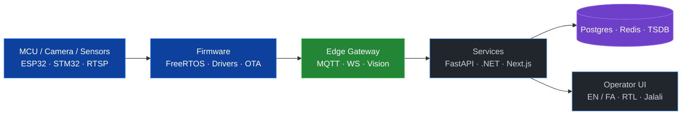

<!-- github.com/omidram — profile README -->

<p align="center">
  <a href="https://github.com/omidram">
    
  </a>
</p>

<p align="center">
  
  
  
</p>

<p align="center">
  <a href="mailto:omid40210@gmail.com"></a>
  <a href="https://www.linkedin.com/in/omid-ramshini-775137243/"></a>
  <a href="https://t.me/Omid_Ram"></a>
  <a href="https://github.com/omidram"></a>
</p>

---

### Who I am

**Embedded & systems engineer** building from bare-metal firmware to production web products.  
I ship **high-reliability IoT/IIoT devices** and **Persian RTL platforms** used in industry, logistics, healthcare, and surveillance.

Currently at **TrendHorizon / Pars Pardaz** — bridging hardware, edge gateways, and operator-facing software.

```text
 silicon ──► RTOS firmware ──► edge gateway ──► APIs & dashboards ──► operators
```

<details>
<summary><b>What I care about</b></summary>

<br/>

- Deterministic firmware: FreeRTOS, DMA-aware drivers, OTA with rollback  
- Industrial UX: bilingual EN/FA, Jalali calendar, Access-era workflows modernized  
- Edge vision that actually runs: OpenCV / ONNX / YOLO where the plant needs it  
- Clean delivery: CMake/PlatformIO, Docker, GitHub Actions, testable modules  

</details>

---

### Featured work

| Project | What it is | Stack |
|:--------|:-----------|:------|
| [**balaban**](https://github.com/omidram/balaban) | Lightweight Ubuntu NVR — live RTSP, go2rtc, ffmpeg recording, Persian RTL UI | Go · ffmpeg · go2rtc |
| [**shidvar**](https://github.com/omidram/shidvar) | B2B cargo matching & logistics — requester / supplier / driver / admin + e-POD | Next.js · Prisma · PostgreSQL |
| [**hamkar**](https://github.com/omidram/hamkar) | Enterprise workspace — CRM, tasks, chat, letters, invoices, multi-tenant RLS | FastAPI · React · Redis |
| [**aroxis**](https://github.com/omidram/aroxis) | Persian marketplace for CCTV, alarms, networking & smart home + installer services | Next.js · TypeScript |
| [**tapesh**](https://github.com/omidram/tapesh) | Family EHR keyed by national ID — e-prescription, labs, insurance sandboxes | Next.js · Tailwind |
| [**itf-luggage-scanner**](https://github.com/omidram/itf-luggage-scanner) | High-FPS ITF luggage-tag scanner for ~1 m/s airport conveyors | C++ · OpenCV · ONVIF |
| [**kairos-stm32f746-desk**](https://github.com/omidram/kairos-stm32f746-desk) | Touch-first desk terminal on STM32F746 + LVGL 9 | C · LVGL · STM32 |
| [**parscam**](https://github.com/omidram/parscam) | VMS with YOLO detection | Next.js · Vision |
| [**building-manager**](https://github.com/omidram/building-manager) | Residential building OS — charges OCR, votes, tickets, Jalali clock | TypeScript |
| [**nasl-farda-tracker**](https://github.com/omidram/nasl-farda-tracker) | Heavy-fleet telematics — live map, dashcam, geofence, alerts | TypeScript |

> Also shipping a private **industrial electrolyzer management** stack (Next.js + FastAPI) as a modern replacement for legacy Access plant software.

---

### Tech radar

<p align="center">
  
</p>

<details>
<summary><b>Languages & runtimes</b></summary>

<br/>


</details>

<details>
<summary><b>Embedded / edge</b></summary>

<br/>


</details>

<details>
<summary><b>Product / platform</b></summary>

<br/>


</details>

---

### How I build systems


```mermaid
flowchart LR
  classDef hw fill:#0d419d,stroke:#1f6feb,color:#fff
  classDef edge fill:#238636,stroke:#3fb950,color:#fff
  classDef app fill:#21262d,stroke:#58a6ff,color:#c9d1d9
  classDef data fill:#6e40c9,stroke:#a371f7,color:#fff

  HW["MCU / Camera / Sensors<br/>ESP32 · STM32 · RTSP"]:::hw
  FW["Firmware<br/>FreeRTOS · Drivers · OTA"]:::hw
  GW["Edge Gateway<br/>MQTT · WS · Vision"]:::edge
  API["Services<br/>FastAPI · .NET · Next.js"]:::app
  DB[("Postgres · Redis · TSDB")]:::data
  UI["Operator UI<br/>EN / FA · RTL · Jalali"]:::app

  HW --> FW --> GW --> API
  API --> DB
  API --> UI
```

---

### Activity

<p align="center">
  
  
</p>

<p align="center">
  
</p>

<p align="center">
  
</p>

---

### Now / next

- Production-grade **ESP32 / STM32** templates — OTA, CI artifacts, unit tests  
- Reusable **driver BSPs** (I²C / SPI / UART / DMA) with host-side tests  
- Industrial dashboards that feel as fast as the plant floor  
- Edge vision pipelines that stay maintainable after deployment  

---

### Let's build

If you need **firmware that survives the field**, an **edge gateway**, or a **serious Persian product UI** — let's talk.

<p align="center">
  <a href="mailto:omid40210@gmail.com"></a>
  <a href="https://www.linkedin.com/in/omid-ramshini-775137243/"></a>
  <a href="https://t.me/Omid_Ram"></a>
</p>

<p align="center">
  <sub>Built with intention · Tehran · TrendHorizon / Pars Pardaz</sub>
</p>
