<!--
  Replace YOUR_USERNAME, EMAIL_ADDRESS, WEBSITE_URL, LINKEDIN_URL
  Colors & shields are intentionally rich for a “pro/old user” vibe.
-->

<!-- Header / Typing -->

  

<h1 align="center">Hi, I'm <b>Omid</b> 👋</h1>

<b>Embedded & Systems Developer</b> · C/C++/C# · Python · ESP-IDF · STM32 · PlatformIO · FreeRTOS · IoT/IIoT

  
  
  

  
  
  
  

---

## 💫 About Me
> Tehran, Iran · Shipping reliable firmware and edge services; turning hardware ideas into production-ready IoT/IIoT systems.

- 🧩 **Embedded**: ESP-IDF, STM32 HAL/LL، FreeRTOS، PlatformIO، Arduino (Core/ESPHome/MicroPython)  
- 🧠 **Edge AI/Vision** (practical): OpenCV، ONNX Runtime، YOLO-based inference در لبه  
- 🌐 **Gateways/Backends**: C#/.NET (Minimal APIs، WebSocket، gRPC، MQTT)، Python (FastAPI، tooling)  
- 🧪 **Quality**: CI/CD با GitHub Actions، تست واحد (Unity/cmocka/xUnit)، clang-format/clang-tidy  
- 🏗 **Infra**: Docker/Compose، Dev Containers، Home Assistant integrations

---

## 🛠 Tech Stack (Badges)

### Languages

### Embedded / RTOS / Tooling

-512BD4?logo=zephyrproject&logoColor=white)

### Edge / Apps / Cloud

### Vision / AI (practical)

---

## 🎯 Current Focus

- 🚀 **ESP32/STM32 Production Templates**  
  CMake + FreeRTOS + OTA pipelines + Unit Testing + CI Artifacts  

- 🔧 **Drivers & BSPs**  
  Developing reusable libraries for **I2C / SPI / UART / DMA / Timers** with logic-level unit tests  

- 🌐 **Edge Gateways**  
  Building scalable **C#/.NET services** for MQTT / WebSocket / gRPC telemetry and vision processing  

- 🏡 **Home Assistant Integrations**  
  Clean, automated discovery flows · Well-documented components · Hassle-free deployments  

---

---

## 🏆 Achievements & Highlights

  
  
  

### 🎖 Key Highlights
- 🏆 **10+ years of coding experience** across **C/C++/C#** and **Python**.  
- 🥇 Designed and shipped **20+ production-ready firmware projects** (ESP32, STM32).  
- 🏅 Built **CI/CD pipelines** that cut firmware delivery time by **40%**.  
- 🏆 Contributed to **IoT/IIoT deployments** in industrial automation and smart home solutions.  
- 🥇 Integrated **Edge AI (ONNX + OpenCV)** into embedded systems for real-time vision.  
- 🏅 Open-source contributions in **ESP-IDF templates**, **Home Assistant components**, and **PlatformIO libraries**.  
- 🏆 Mentored junior engineers and helped scale teams in embedded product design.  

---

## 🏅 GitHub Trophies

  

---

## 🚀 Career Achievements (Highlights)

| Year | Achievement |
|------|-------------|
| **2025** | Released **ESP-IDF Production Template** (OTA + CI/CD + Unit Tests) |
| **2024** | Built **.NET Edge Gateway** for industrial IoT telemetry with vision support |
| **2023** | Deployed **Smart Home HA ecosystem** with MQTT + ESPHome integrations |
| **2022** | Led development of **multi-board PlatformIO monorepo** with shared drivers |
| **2020** | Delivered **industrial BLDC motor driver** firmware for production |
| **2018** | Published **STM32 HAL/LL boilerplate** open-source project |
| **2015** | First production firmware for **ESP8266/ESP32** based IoT sensors |

---

## 🥇 Additional Badges

  
  
  
  

---

---
## 🧩 Architecture Snapshot

```mermaid
flowchart LR
  %% ───────────────────────── Styles ─────────────────────────
  classDef edge   fill:#0b7285,stroke:#063b46,stroke-width:1.2,color:#fff;
  classDef gw     fill:#2c2d84,stroke:#11134d,stroke-width:1.2,color:#fff;
  classDef cloud  fill:#495057,stroke:#212529,stroke-width:1.2,color:#fff;
  classDef store  fill:#6c757d,stroke:#343a40,color:#fff;
  classDef broker fill:#198754,stroke:#0f5132,color:#fff;
  classDef api    fill:#6f42c1,stroke:#41276b,color:#fff;
  classDef alert  fill:#b02a37,stroke:#58151c,color:#fff;

  %% ───────────────────────── Edge Device ─────────────────────────
  subgraph EDGE["IoT Device — ESP32/STM32 (FreeRTOS)"]
    direction TB
    DRV["Peripherals<br/>I2C · SPI · UART · ADC · PWM"]:::edge
    RTOS["Tasks<br/>sensor_task · net_task · ota_task · app_task"]:::edge
    NET["Network Stack<br/>Wi-Fi/Ethernet · TCP/IP · TLS/mTLS"]:::edge
    SEC["Secure Identity<br/>Device keys · X.509 certs"]:::edge
    FS["Storage<br/>NVS · SPIFFS/LittleFS"]:::store
    LOG["Diagnostics<br/>Structured logs · metrics · ringbuf"]:::edge
    OTA["OTA Client<br/>HTTP(S) dual-slot · rollback"]:::edge
    DRV --> RTOS --> NET
    SEC --> NET
    RTOS --> LOG
    RTOS --> FS
    OTA  --> FS
  end

  %% ───────────────────────── Edge Gateway ─────────────────────────
  subgraph GATEWAY[".NET Edge Gateway"]
    direction TB
    IN["Ingress<br/>WebSocket · MQTT"]:::gw
    PROC["Processing<br/>Rules · Filters · OpenCV/ONNX (opt)"]:::gw
    QUEUE["Backpressure<br/>Channels/Queues"]:::gw
    CACHE["Local Cache<br/>SQLite/Redis"]:::store
    APIGW["Adapters<br/>REST/gRPC ↔ MQTT/WS"]:::api
    IN --> PROC --> QUEUE --> APIGW
    PROC --> CACHE
  end

  %% ───────────────────────── Cloud / On-Prem ─────────────────────────
  subgraph CLOUD["Cloud / On-Prem Platform"]
    direction TB
    REG["Device Registry & Provisioning<br/>IDs · policies · certificate issuance"]:::cloud
    BROKER["MQTT Broker"]:::broker
    API["Core Services<br/>REST/gRPC APIs"]:::api
    OTA_SRV["OTA Server<br/>firmware hosting & manifests"]:::cloud
    TSDB["Time-Series DB<br/>Influx/Timescale"]:::store
    DASH["Dashboards<br/>Home Assistant · Grafana"]:::cloud
    ALERT["Monitoring & Alerts<br/>Prometheus/Alertmanager"]:::alert
    CI["CI/CD — GitHub Actions<br/>builds · tests · artifacts · releases"]:::cloud

    REG --> BROKER
    API --> DASH
    BROKER --> TSDB
    TSDB --> DASH
    CI --> OTA_SRV
  end

  %% ───────────────────────── Data / Control Flows ─────────────────────────
  %% Telemetry & Commands
  EDGE -- "telemetry (MQTT)" --> BROKER
  BROKER -- "commands / RPC" --> EDGE

  %% Edge ↔ Gateway
  EDGE -- "WebSocket / MQTT" --> IN
  APIGW -- "normalized events" --> API

  %% Automations / Integrations
  API -- "rules / automations" --> BROKER

  %% OTA Pipeline
  CI -- "signed artifacts" --> OTA_SRV
  OTA_SRV -- "firmware.bin" --> EDGE

  %% Provisioning / Security
  REG -- "device certs / mTLS" --> EDGE

  %% Observability
  LOG -. "optional syslog/serial" .-> GATEWAY
  API --> ALERT
  BROKER --> ALERT
```

---
## 🧩 Device Flow: Provisioning → Connectivity → OTA → Telemetry

